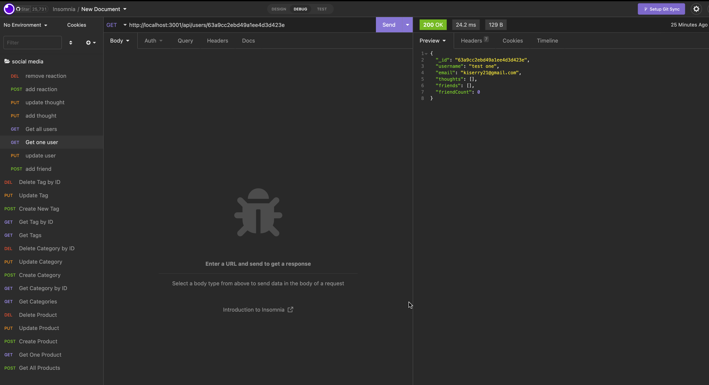
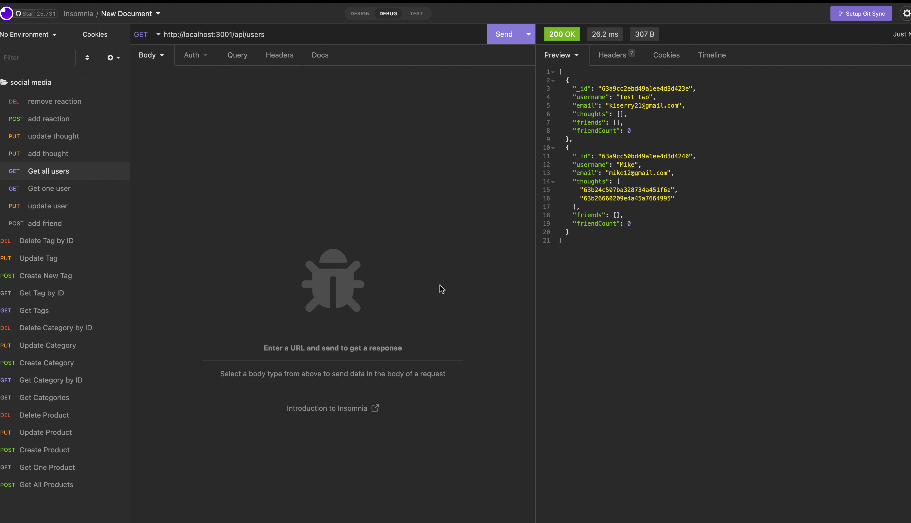
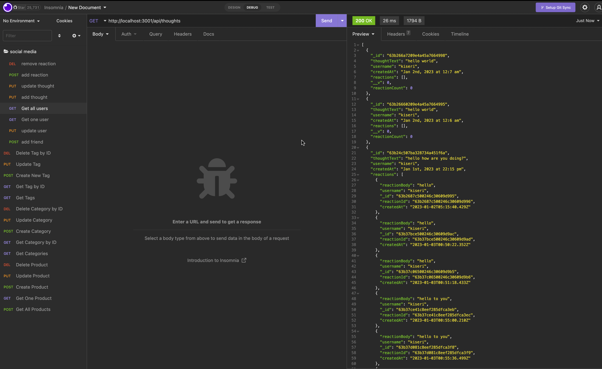

# Social-Network-API
This program is an API for a web-based social network application where users can express their ideas, respond to those of friends, and build a friend list. This backend, which can be utilized by social media start-ups, makes use of a NOSQL database, Express.js for routing, MongoDB for storage, and Mongoose ODM to handle sizable amounts of unstructured data, such as User and Thought models and schemas and Reaction subdocument schema. The server is launched and the Mongoose models are synced with the MongoDB database when the application is invoked.

# User Story

AS A social media startup
I WANT an API for my social network that uses a NoSQL database
SO THAT my website can handle large amounts of unstructured data

# Acceptance Criteria

GIVEN a social network API

WHEN I enter the command to invoke the application

THEN my server is started and the Mongoose models are synced to the MongoDB database

WHEN I open API GET routes in Insomnia for users and thoughts

THEN the data for each of these routes is displayed in a formatted JSON

WHEN I test API POST, PUT, and DELETE routes in Insomnia

THEN I am able to successfully create, update, and delete users and thoughts in my database

WHEN I test API POST and DELETE routes in Insomnia

THEN I am able to successfully create and delete reactions to thoughts and add and remove friends to a user’s friend list

# Mock-Up

